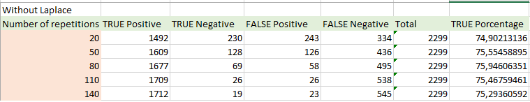

```{r setup, include=FALSE}
knitr::opts_chunk$set(echo = FALSE)
dsMovies <- read.csv("dsMovies.csv", stringsAsFactors = FALSE, header = TRUE)
```

## Abstract

We used a dataset of movies reviews, with 5331 positive reviews and 2332 negative reviews, we get the dataset from a project of github where is use to practice data science with python.

We used this dataset to predict if a new review is negative or positive with naive bayes.

## Index


## The dataset

```{r dsMovies, echo=TRUE}
summary(dsMovies)
str(dsMovies)
```

## The dataset (2)

```{r dsMovies2, echo=TRUE}
head(dsMovies)
```

## The dataset (3)

```{r dsMovies3, echo=TRUE}
tail(dsMovies)
```

## The dataset (4)

```{r dsMovies4, echo=TRUE}
dsMovies$type <- factor(dsMovies$type)
table(dsMovies$type)
```

## Plot of reviews

```{r dsMoviesplot, echo=TRUE}
barplot(table(dsMovies$type), xlab = "Quantity", ylab = "Type", horiz = TRUE, col='#2999AD')
```

## Preprocessing 

```{r corpus, echo=TRUE}
library("tm")
dsMoviesCorpus <- VCorpus(VectorSource (dsMovies$message))
inspect(dsMoviesCorpus[1:2])
```

## Preprocessing (2)

```{r corpusPrint, echo=TRUE}
library("tm")
print(dsMoviesCorpus[[1]])
as.character(dsMoviesCorpus[[1]])
```

## Preprocessing (3) To Lowercase

```{r tolowercase, echo=TRUE}
dsMovies_clean <- tm_map ( dsMoviesCorpus, content_transformer(tolower))
as.character(dsMoviesCorpus[[1]])
as.character(dsMovies_clean[[1]])
```

## Preprocessing (4) Remove Numbers

```{r removenumbers, echo=TRUE}
dsMovies_clean <- tm_map ( dsMovies_clean, removeNumbers)
as.character(dsMoviesCorpus[[32]])
as.character(dsMovies_clean[[32]])
```

## Preprocessing (5) Remove STOP WORDS

```{r removestopwords, echo=TRUE}
dsMovies_clean <- tm_map ( dsMovies_clean, removeWords, stopwords('spanish'))
dsMovies_clean <- tm_map ( dsMovies_clean, removeWords, stopwords())
as.character(dsMoviesCorpus[[6]])
as.character(dsMovies_clean[[6]])
```

## Preprocessing (6) Remove Punctuation

```{r removepunctuation, echo=TRUE}
dsMovies_clean <- tm_map ( dsMovies_clean, removePunctuation)
as.character(dsMoviesCorpus[[6]])
as.character(dsMovies_clean[[6]])
```

## Preprocessing (7) Remove Spaces

```{r removespaces, echo=TRUE}
dsMovies_clean <- tm_map ( dsMovies_clean, stripWhitespace)
as.character(dsMoviesCorpus[[1576]])
as.character(dsMovies_clean[[1576]])
```

## Preprocessing (8) Create the DTM

```{r createdtm, echo=TRUE}
dsMovies_dtm <- DocumentTermMatrix (dsMovies_clean)
str(dsMovies_dtm)
```

## Preprocessing (9) Create the train and test set

```{r createtraintest, echo=TRUE}
dsMovies_dtm_train <- dsMovies_dtm[1:5364, ]
dsMovies_dtm_test <- dsMovies_dtm[5365:7663, ]
dsMovies_train_labels <- dsMovies[1:5364,]$type
dsMovies_test_labels <- dsMovies[5365:7663,]$type
prop.table(table(dsMovies_train_labels))
prop.table(table(dsMovies_test_labels))
```

## The wordcloud of the clean dataset
```{r wordcloudlibrary, include=FALSE}
library("wordcloud")
```

```{r wordcloud, echo=TRUE}
wordcloud(dsMovies_clean, min.freq = 50, random.order = FALSE)
```

## Barplot of most common words
```{r plotwordspre, include=FALSE}

library(dplyr)
library(tidytext)
library(tidyr)


bing <- get_sentiments("bing")
tidy_dsMovies <- dsMovies %>%
  unnest_tokens(word, message)

data("stop_words")
dsMoviesCl <- tidy_dsMovies %>%
  anti_join(stop_words)
res = dsMoviesCl %>%
  count(word, sort = TRUE)
```


```{r plotwords, echo=TRUE}
barplot(res[1:10,]$n, xlab = "Word", ylab = "Quantity", horiz = FALSE, col='#2999AD',names.arg=res[1:10,]$word, cex.names=0.7)
```

## List of most common words
```{r listwords, echo=TRUE}
res[1:10,]
```

## Naive Bayes. Formula

$P(A|B)=\frac{P(B|A)P(A)}{P(B)}$

## Naive Bayes. Frequent Words
```{r frequentwords, echo=TRUE}
dsMovies_freq_words <- findFreqTerms(dsMovies_dtm_train,20)
str(dsMovies_freq_words)
dsMovies_dtm_freq_train <- dsMovies_dtm_train[,dsMovies_freq_words]
dsMovies_dtm_freq_test <- dsMovies_dtm_test[,dsMovies_freq_words]
```

## Naive Bayes. Frequent Words (2)
```{r frequentwords2, echo=TRUE}
dsMovies_dtm_freq_train
dsMovies_dtm_freq_test
```

## Naive Bayes. (2) Convert to categorical data.
```{r categoricaldata, echo=TRUE}
converts_counts <- function(x){x <- ifelse(x>0,"Yes","No")}
dsMovies_train <- apply(dsMovies_dtm_freq_train, MARGIN = 2, converts_counts)
dsMovies_test <- apply(dsMovies_dtm_freq_test, MARGIN = 2, converts_counts)
```

## Naive Bayes. (3) Clasification outputs without laplace.
```{r clasification, echo=TRUE}
library(e1071)
dsMovies_classifier <- naiveBayes(dsMovies_train,dsMovies_train_labels)
dsMovies_text_pred <- predict(dsMovies_classifier,dsMovies_test)
table(dsMovies_text_pred)
```

## Naive Bayes. (4) Frequency table without laplace.
```{r freqtable, echo=TRUE}
table(dsMovies_text_pred,dsMovies_test_labels)
```

## Naive Bayes. (5) Frequency table with laplace.
$P(X_i = x_i | Y = y) = 0$
```{r freqtable2, echo=TRUE}
library(e1071)
dsMovies_classifier <- naiveBayes(dsMovies_train,dsMovies_train_labels,laplace = 1)
dsMovies_text_pred <- predict(dsMovies_classifier,dsMovies_test)
table(dsMovies_text_pred,dsMovies_test_labels)
```

## Comparative table without laplace
<center>


## Comparative table with laplace
<center>
