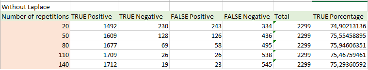
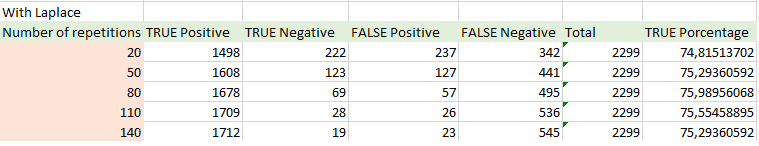

### Step 1. Preparing the data!

##### We read the data with headers, and taking all data frame treated as just plain strings. We assigned this data into a variable "dsMovies"
```{r setup, leer}
knitr::opts_chunk$set(echo = TRUE)
#dsMovies <- read.table(file = 'movie-reviews-dataset.tsv', sep = '\t', header = TRUE)
dsMovies <- read.csv("dsMovies.csv", stringsAsFactors = FALSE, header = TRUE)
```

### Step 2. Checking dataset. 

##### First of all we make a summary of dataset which has a length of 10662 characters in "type" column, and in "message" column we have a length of 10662 characters.
##### We see the structure that has 7663 observable plain strings on 2 columns.
##### We show the first 6 records value of "type" column, and then another 6 records value of column message.
##### We show the last 6 records value of "type" column (from 7658 - 7663 rows), and then another last 6 records value of column message.
##### It's time to make factors the 2 values of column "type" which we have negateive or positive, this for the next step that is Preeproccesing.
##### For last, we show how many values for each factor, which we expect 2332 negative messages and 5331 positive.
```{r dsMovies}
summary(dsMovies)
str(dsMovies)
head(dsMovies)
tail(dsMovies)
dsMovies$type <- factor(dsMovies$type)
table(dsMovies$type)
```

##### In the following graph we can observe the amount of positive and negative messages that we have in our dataset. We have 7663 messages in total, 5331 are positive and 2332 are negative.
```{r dsMoviesplot}
barplot(table(dsMovies$type), xlab = "Quantity", ylab = "Type", horiz = TRUE, col='#990066')
```


### Step 3. Preprocessing

##### We load the library "tm" which holds the format VCorups of Text Documents, which create a volatile corpora.
##### Then we inspect "dsMoviesCorpus" and it has a content of 2 documents, which the First Plain Text document has a content of 101 characters, and in Second Plain Text document has 201 characters.
```{r}
library("tm")
dsMoviesCorpus <- VCorpus(VectorSource (dsMovies$message))
print(dsMoviesCorpus)
inspect(dsMoviesCorpus[1:2])
```

### Step 4. Checking the first message

##### We print the information of the "dmMoviesCorupes" (first message), then we convert it into character to see the message in.
```{r, ver el primer mensaje}
library("tm")
print(dsMoviesCorpus[[1]])
as.character(dsMoviesCorpus[[1]])
```

### Step 5. Checking multiple messages

##### We print different messages, for this we use the function "lapply" to transform in range of rows the messages and converts to character.
```{r, ver multiples mensajes}
library("tm")
lapply(dsMoviesCorpus[1:5], as.character)
```

### Step 6. Transform to Lower Case. 

##### This is the preparation of the data set, in a formal way we call this "CLEAN THE DATA", first we will transform all messages to lowercase with the function tolower(), for checking we print with "as.character" function. Let's check the transformation by comparing a message in the original corpus in the transformed corpus. 
```{r, a minusculas}
dsMovies_clean <- tm_map ( dsMoviesCorpus, content_transformer(tolower))
as.character(dsMoviesCorpus[[1]])
as.character(dsMovies_clean[[1]])
```

### Step 7. Remove numbers 

##### After that we will remove all numbers in the mssages using the function "content_transformer()", this is because removeNumbers() is built into tm along with several ther mapping function that do not need to be wraped. For checking we print with "as.character" function. Let's check the transformation by comparing a message in the original corpus in the transformed corpus. 

```{r, remueve numeros}
dsMovies_clean <- tm_map ( dsMovies_clean, removeNumbers)
as.character(dsMoviesCorpus[[32]])
as.character(dsMovies_clean[[32]])
```

### Step 8. Remove STOP WORDS

##### Remove stop words is to remove filler words, this is before text analysis, that wordsdoesn't give valious information about the meaning of the message. We use function stopwords(), that fuction allow us to access various sets of stop words, in this case for "Spanish" and the default one that (english). We'll also use the tm_map() function to apply this mapping to the data, providing the stopwords() as parameters, in this way we could indicate the words we would like to remove. For checking we print with "as.character" function. Let's check the transformation by comparing a message in the original corpus in the transformed corpus. 

```{r, quitar stop words}
#stopwords()
#stopwords('spanish')
dsMovies_clean <- tm_map ( dsMovies_clean, removeWords, stopwords('spanish'))
dsMovies_clean <- tm_map ( dsMovies_clean, removeWords, stopwords())
as.character(dsMoviesCorpus[[6]])
as.character(dsMovies_clean[[6]])
as.character(dsMoviesCorpus[[1200]])
as.character(dsMovies_clean[[1200]])
```
### Step 9. Remove Punctuation

##### Now we remove any punctuation mark, like parenthesis, comas, ponts, etc. For checking we print with "as.character" function. Let's check the transformation by comparing a message in the original corpus in the transformed corpus.

```{r, quitar puntuaci??n}
dsMovies_clean <- tm_map ( dsMovies_clean, removePunctuation)
as.character(dsMoviesCorpus[[6]])
as.character(dsMovies_clean[[6]])
```

### Step 10. Remove Spaces

##### Here we remove reamining white spaces, using the funtion stripWhitespace(). For checking we print with "as.character" function. Let's check the transformation by comparing a message in the original corpus in the transformed corpus.

```{r, quitar espacios en blanco}
dsMovies_clean <- tm_map ( dsMovies_clean, stripWhitespace)
as.character(dsMoviesCorpus[[452]])
as.character(dsMovies_clean[[452]])
```

### Step 11. Data Preparation for Analysis

##### We need to create a DocumentTermMatrix() that allows us to create a Document in Matrix using the function "DocumentTermMatrix()", well being more specific is a sparse matrix, which cells have a value of zero.
```{r, matriz esparcida}
dsMovies_dtm <- DocumentTermMatrix (dsMovies_clean)

str(dsMovies_dtm)
```

### Step 12. Creating training and test Datasets

##### Here its very simply we divide the data in 2 sections: 75 percent for training and 25 percent for testing.
##### Here we try to have both groups of data balanced, from the point of view that we have more or less the same amount of both positive and negative messages in both sets of training and testing.
```{r, separacion train test}
dsMovies_dtm_train <- dsMovies_dtm[1:5364, ]
dsMovies_dtm_test <- dsMovies_dtm[5365:7663, ]
dsMovies_train_labels <- dsMovies[1:5364,]$type
dsMovies_test_labels <- dsMovies[5365:7663,]$type
prop.table(table(dsMovies_train_labels))
prop.table(table(dsMovies_test_labels))
```
### Step 13. Visualizing text data

##### In the next section we can observe a word cloud that allows us to observe the frequency with which the words appear in the messages.

```{r, wordcloud}
library("wordcloud")
wordcloud(dsMovies_clean, min.freq = 40, random.order =TRUE)
```

##### Now we can observe the wordcloud of how often words appear only in negative messages.
```{r, Palabras m??s significativas de los mensajes malos (bad)}
bad <- subset(dsMovies, type=="negative")
good <- subset(dsMovies, type =="positive")

wordcloud(bad$message, max.words = 80, scale = c(5, 0.5))
```

##### Now we can observe the wordcloud of how often words appear only in positive messages.
```{r, Palabras m??s significativas de los mensajes malos (bad)}
bad <- subset(dsMovies, type=="negative")
good <- subset(dsMovies, type =="positive")

wordcloud(good$message, max.words = 80, scale = c(5, 0.5))
```


##### To work with this as a tidy dataset, we need to restructure it as one-token-per-row format. The unnest_tokens function is a way to convert a dataframe with a text column to be one-token-per-row:
##### This function uses the tokenizers package to separate each line into words. The default tokenizing is for words, but other options include characters, ngrams, sentences, lines, paragraphs, or separation around a regex pattern.

##### Now that the data is in one-word-per-row format, we can manipulate it with tidy tools like dplyr. We can remove stop words (kept in the tidytext dataset stop_words) with an anti_join.

##### We can also use count to find the most common words in all the books as a whole.

##### Then those are the ten most common words in our dataset, but ilustrated with a barplot.
```{r plotWords}

library(dplyr)

library(tidytext)
library(tidyr)


bing <- get_sentiments("bing")

tidy_dsMovies <- dsMovies %>%
  unnest_tokens(word, message)

data("stop_words")
dsMoviesCl <- tidy_dsMovies %>%
  anti_join(stop_words)

res = dsMoviesCl %>%
  count(word, sort = TRUE)

barplot(res[1:10,]$n, xlab = "Word", ylab = "Quantity", horiz = FALSE, col='#FF6100',names.arg=res[1:10,]$word, cex.names=0.7)
res[1:10,]
```

###### Let???s find a sentiment score for each word using the Bing lexicon, then count the number of positive and negative words in the messages.
###### One advantage of having the data frame with both sentiment and word is that we can analyze word counts that contribute to each sentiment.
###### This can be shown visually, and we can pipe straight into ggplot2 because of the way we are consistently using tools built for handling tidy data frames.
```{r, frequent words}
library(ggplot2)
bing_word_counts <- tidy_dsMovies %>%
  inner_join(bing) %>%
  count(word, sentiment, sort = TRUE) %>%
  ungroup()

bing_word_counts

bing_word_counts %>%
  filter(n > 50) %>%
  mutate(n = ifelse(sentiment == "negative", -n, n)) %>%
  mutate(word = reorder(word, n)) %>%
  ggplot(aes(word, n, fill = sentiment)) +
  geom_bar(stat = "identity") +
  theme(axis.text.x = element_text(angle = 90, hjust = 1)) +
  ylab("Contribution to sentiment")
```

### Step 14. Creating indicator for Frequent Words

##### In this step we use the function findFreqTerms() to get which words appear more frequently in the whole datasets.

```{r, frequent words}
dsMovies_freq_words <- findFreqTerms(dsMovies_dtm_train,20)
str(dsMovies_freq_words)
dsMovies_dtm_freq_train <- dsMovies_dtm_train[,dsMovies_freq_words]
dsMovies_dtm_freq_test <- dsMovies_dtm_test[,dsMovies_freq_words]
dsMovies_dtm_freq_train
dsMovies_dtm_freq_test
```

### Step 15. The Naive Bayes classifier need categorical data.

##### First, we categrize the data, because Naive Bayes needs it; we make a function the in the train and test dataset, to apply the converts_counts.

```{r}
converts_counts <- function(x){x <- ifelse(x>0,"Yes","No")}
dsMovies_train <- apply(dsMovies_dtm_freq_train, MARGIN = 2, converts_counts)
dsMovies_test <- apply(dsMovies_dtm_freq_test, MARGIN = 2, converts_counts)
```


##Naive Bayes classification outputs.

### Step 16. Naive Bayes classification outputs.

##### We build a model on the train data, with the name of dsMovies classifier, and another with dsMovies predictions, that will return a vector of predicted class values or raw predicted probabilites depending upon the value of the type parameter.

```{r}
library(e1071)
dsMovies_classifier <- naiveBayes(dsMovies_train,dsMovies_train_labels)
dsMovies_text_pred <- predict(dsMovies_classifier,dsMovies_test)
table(dsMovies_text_pred)
```
### Step 17. Frequency Table.

##### For the fnal step we evaluate our moel on useed data, we compare the predictions with true values.
##### Compare predictions vs real classes.
##### This is the result with minimum 20 repetitions of each word in the reviews without laplace.
```{r}
library(gmodels)
#CrossTable(dsMovies_text_pred,dsMovies_test_labels,prop.chisq = FALSE,prop.t = FALSE, dnn = c('predicted','actual'))
table(dsMovies_text_pred,dsMovies_test_labels)

```

##### This is the result with minimum 20 repetitions of each word in the reviews with laplace smoothing.
##### This smoothing is use to  handle cases where
$P(X_i = x_i | Y = y) = 0$

##### To avoid overfitting the data. This is to consider this data, if we don't do this, we will ignore the data with this particular case, and that is bad
```{r}
library(e1071)
dsMovies_classifier <- naiveBayes(dsMovies_train,dsMovies_train_labels,laplace = 1)
dsMovies_text_pred <- predict(dsMovies_classifier,dsMovies_test)
table(dsMovies_text_pred,dsMovies_test_labels)

```

###Comparative table without laplace
<center>


###Comparative table with laplace
<center>


### Conclusions and Limitations
#### Does the study generalize to other domains?
#####  Yes, in fact Naive Bayes has been used in many other domains, for example in Medical Data Classification, for example in pattern recognition and image processing also for improving diagnostic speed and increasing the quality of medical treatment if we have a data set of determined symptoms and the disease is helpful to give a prediction of the illness for a result of a "good" or "bad" diagnosis. 

#### Limitations
##### There are some limitation in the dataset for example, we have a little portion of a dataset that is based in some reviews of some cinema critics, but we have ony a few portion of critics and it doesn't reflect an absolute truth review for a movie.

#### Advantages
##### This study reflects a good use of prediction with this dataset, we have a positive or negative review, we can use this to analyze personal opinions in different aspects of a book for example, but in general we can add more reviews of movies to the dataset and the accuracy of prediction wil maintain in the same level.